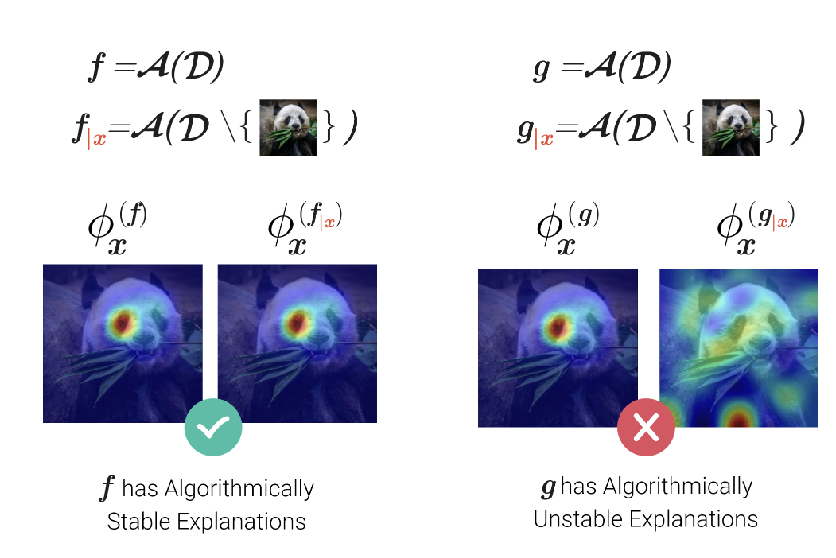
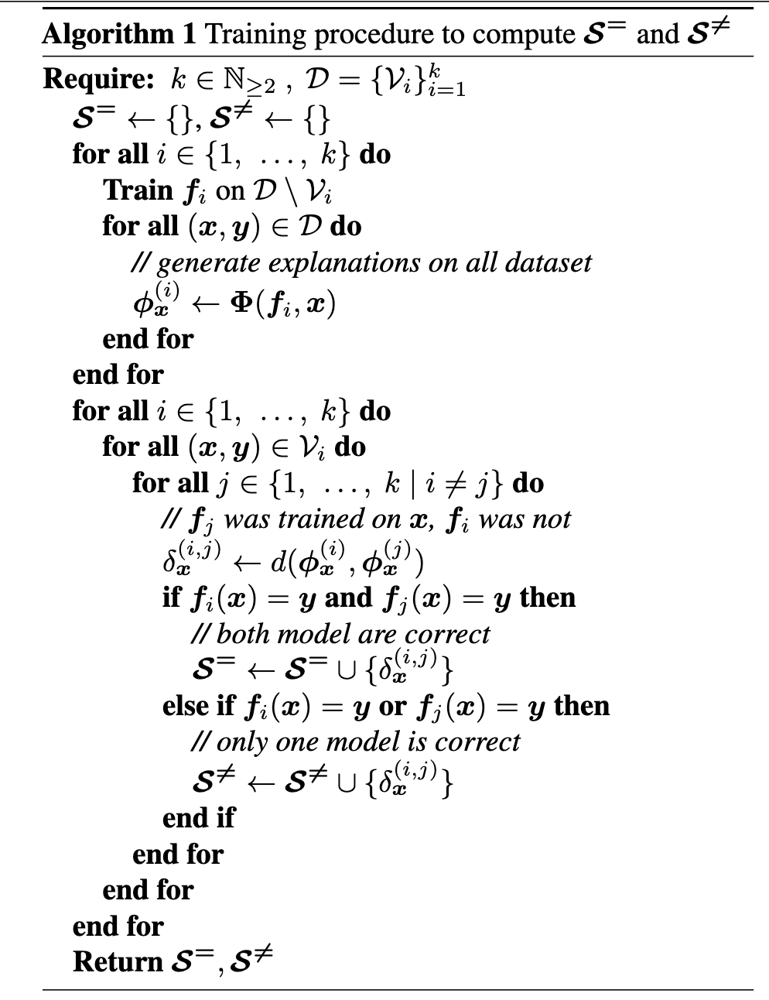

## How good is your Explanation
### Algorithmic Stability Measures to Assess the Quality of Explanations for Deep Neural Networks
NoteBook Deep Learning Guillaume BERTHELOT

This notebook is freely inspired by the article ["How good is Your Explanation"](https://openaccess.thecvf.com/content/WACV2022/html/Fel_How_Good_Is_Your_Explanation_Algorithmic_Stability_Measures_To_Assess_WACV_2022_paper.html)

[1] Fel, Thomas and Vigouroux, David and Cadène, Rémi and Serre, Thomas, "How Good Is Your Explanation? Algorithmic Stability Measures To Assess the Quality of Explanations for Deep Neural Networks" Proceedings of the IEEE/CVF Winter Conference on Applications of Computer Vision (WACV), Année.
### Introduction 

The explanability of machine learning algorithms is a fundamental challenge. While these algorithms are now used in an increasing number of domains, the inherent black-box nature of neural networks makes them challenging to deploy in applications where security is a concern. Research on the explanability of neural networks is highly active today. In this notebook, we will explore a proposed method that allows the evaluation of the relevance of an explanability method for a neural network used for image labeling

Numerous explainability methods have been introduced to assess the quality of a neural network. The problem is that each of these explainability methods may harbor biases, especially confirmation bias. Without proper evaluation of these methods themselves, they cannot ensure the quality of a neural network

Intuitively, the method employed by Fel et al. to assess the quality of explainability in decision-making by a convolutional neural network is to observe how robust it is to changes during the training process of a neural network. A good explainability should ideally consistently point to the same regions of the images

<b>The issue is therefore formulated as follows: among a set of CNN models and a set of explainability methods, evaluate, for each pair (CNN, method), the robustness of the explainability.</b>

For each pair (CNN model, explainability method), evaluating the explainability method involves testing its robustness when modifying the training sets of the neural network. An expected outcome for a good explainability method would be that, for two inferences on the same image formulated by two sets of parameters of the same neural network, the areas that contributed the most to the inferences are identical.

    <figure>
        
        <figcaption>Principle of measuring algorithmic stability proposed by [1].</figcaption>
    </figure>

The two sets of parameters are derived from training performed with slightly modified data. One way to achieve this is by taking a training dataset and extracting multiple training datasets with some of the data removed

At this point in the reading, it is useful to recall the work done in the ["Explainability"](https://github.com/SupaeroDataScience/machine-learning/blob/main/14%20-%20Explainability/Notebook_explainability_students_version.ipynb) notebook.

Indeed, even though we won't be using the same libraries here, it is helpful to recall the principle of explanation zone detection.

### What is a good explanation?

Let's introduce three characteristics that a good explainability should possess. 

Fidelity: The metric evaluating an explanation should reflect the internal decision-making process. 

Generalizability, denoted as MeGe: a good explanation should point to identical evidence. 

Lastly, relative consistency, denoted as ReCo: when an image is misclassified, the explanation should point to different areas than those used for a correct explanation.

We are beginning to understand that assessing the quality of an explainability method can be computationally expensive. Through this notebook, I propose to evaluate a method called GRAD-CAM applied to three networks: ResNet 18 and VGG19, trained different datasets, such as MNIST, FashionMNIST or CIFAR10. The provided code can be executed on CUDA or Apple silicon (MPS). If desired, you can retrain the models, which may take some time. The parameters are saved in files, allowing you to quickly replay the quality assessment part without retraining the models.

In this notebook, our concern will be focused on the GRAD-CAM (CG) Method. The Grad-CAM (Gradient-weighted Class Activation Mapping) method is an interpretability technique for neural networks that generates visual explanations by highlighting the regions of an input image that contribute most to the network's decision. It achieves this by leveraging the gradient information flowing into the final convolutional layer to emphasize class-discriminative regions.

For obtaining the map of features activations, we need to compute the weights $\alpha_c^{(k)}$ associated to each of the feature of the map activation 

$\Phi_{GC} = \max(0, \sum_i \sum_j \frac{\partial f_c(x)}{\partial A_{ij}^{(k)}} \cdot \alpha^{(k)}_c A_{ij}^{(k)})$

Now, it's time to roll up our sleeves. We are going to build the following algorithm:

    <figure>
        
        <figcaption>Training procedure [1].</figcaption>
    </figure>

### All the results of this notebook can be retrieved by cloning this repo and then running the notebook